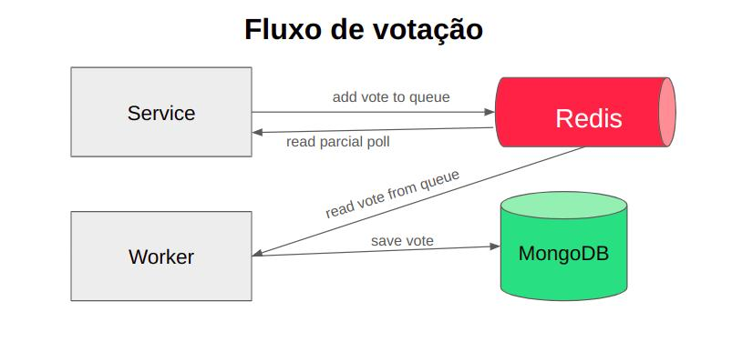

# Voting API


### **API de Votação**  

A API de Votação permite que os usuários criem enquetes e disponibilize a votação de maneira simples e eficiente.  



## Requerimentos

>  [Go 1.23](https://go.dev/doc/install)   
>  [Docker](https://docs.docker.com/engine/install/)   
>  [Docker Composer](https://docs.docker.com/compose/install/)  
>  [Vegeta](https://github.com/tsenart/vegeta)   


<br/>

## Configurações
<br/>

Variáveis de ambiente :

Variavel          | Descrição                            | Valor Padrão  |
------------------|--------------------------------------|---------------|
PORT              |  Server port                         |   8080        |
MONGODB_URL       |  Mongo DB Url connection             |               |
REDIS_HOST        |  Redis instance host                 |               |  
REDIS_PORT        |  Redis instance port                 |               |  

<br/>

###  **Iniciar ambiente**
```sh
make envup
```
- **`docker-compose build`**: Constrói os containers do projeto usando o `docker-compose`.
- **`docker-compose up -d`**: Inicia os containers em **modo desacoplado** (`-d`), ou seja, em segundo plano.

###  **Gerar enquete**
```sh
make setup
```
- Faz uma **requisição HTTP POST** para `http://localhost:8080/poll`.
- Envia um **payload JSON** que cria uma votação com 4 opções (participantes).
- Acesse a enquete no endereço [http://localhost:8080](http://localhost:8080)

### 4. **Finalizar ambiente**
```sh
make envdown
```
- Para e remove os containers e redes criados pelo `docker-compose`.

### **Executar testes unitários**
```sh
make test
```
- Executa **todos os testes unitários** do projeto escritos em Go.
- O `./...` faz com que os testes sejam rodados em todos os pacotes do projeto.


### **Executar teste de performance**
```sh
make attack
```
- Executa **comando vegeta** para simular chamadas simultaneas contra a API.
- O comando simula 1000 chamadas por segundo durante 10s.

Exemplo de saida do comando : 

```sh
Requests      [total, rate, throughput]  10000, 1000.08, 1000.05
Duration      [total, attack, wait]      9.999525892s, 9.999190569s, 335.323µs
Latencies     [mean, 50, 95, 99, max]    339.88µs, 306.141µs, 554.503µs, 918.879µs, 4.550039ms
Bytes In      [total, mean]              3352001, 335.20
Bytes Out     [total, mean]              1030000, 103.00
Success       [ratio]                    100.00%
Status Codes  [code:count]               200:10000  
Error Set:
```


### **Gerar mock**
```sh
make mock: check-mock
```
- Depende do comando `check-mock` (garante que `mockgen` esteja instalado).
- Gera mocks para facilitar testes unitários:
  - Cria um mock para `poll.go` e salva em `mocks/mock_repo_poll.go`.
  - Cria um mock para `captcha.go` e salva em `mocks/mock_cli_captcha.go`.
  - Cria um mock para `pubsub.go` e salva em `mocks/mock_cli_pubsub.go`.

## Documentação

A documentação dos endpoint encontrasse no arquivo [DOCUMENTATION.md](./DOCUMENTATION.md)

## **Possíveis Melhorias Futuras:**  
- Implementar Total de votos por hora 
- Autenticação para rota de criação de enquete e dados totais sobre a enquete 
- Melhoria nos logs
- Adicionar rate limit 
- Utilizar outro tipo de fila de mensagens
- Busca de enquete por ID
- Implementar testes de integração
- Adicionar test coverage 
- Adicionar mais tests unitários 

